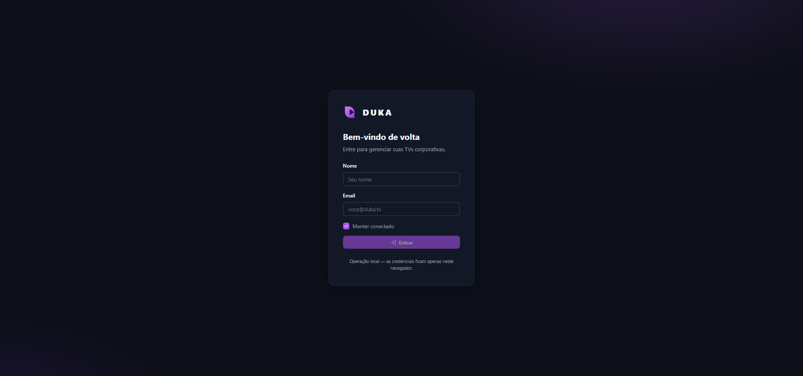
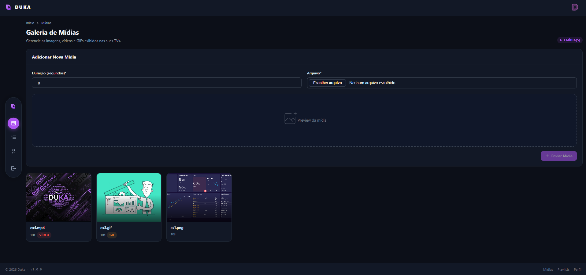
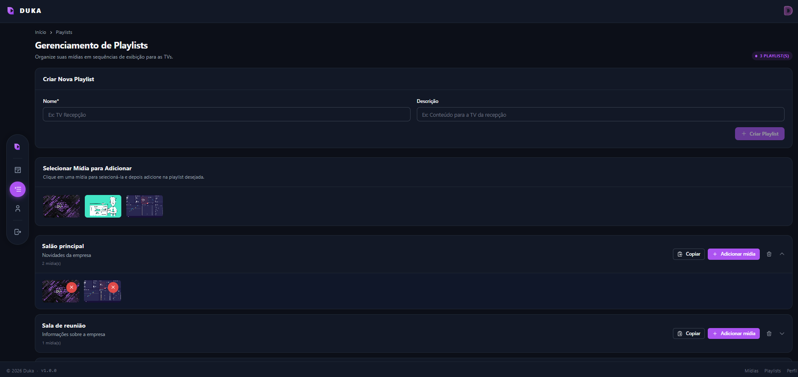
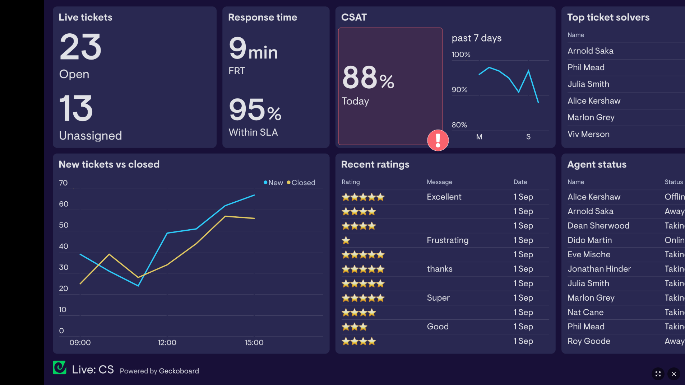
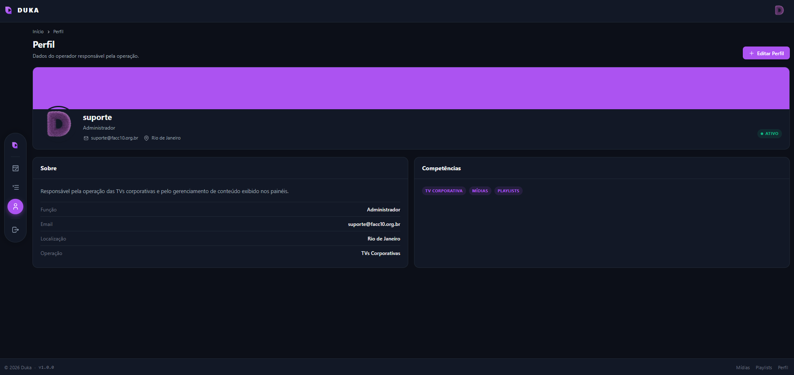
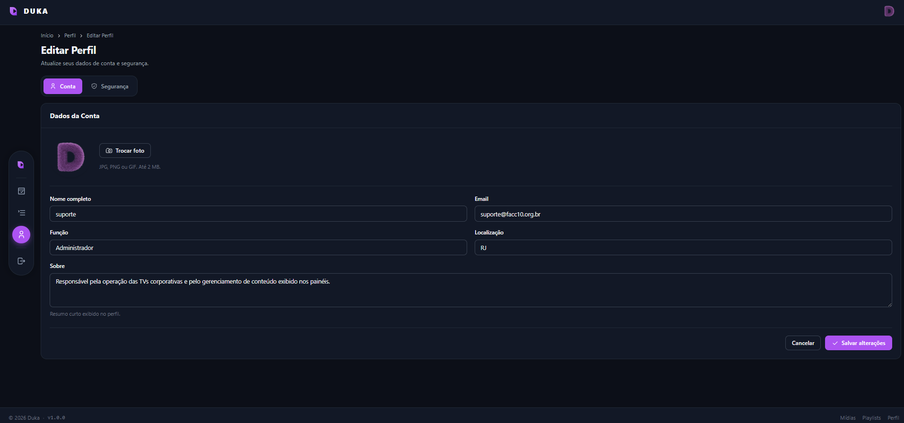

# Duka
Trata-se de um sistema corporativo de gerenciamento de TVs do tipo quiosque.

##
### 1. Login

Tela inicial do sistema. A autenticação é local (navegador): informe nome e e-mail para entrar.



- **Nome** e **E-mail**: identificam o usuário.
- **Manter conectado**: se marcado, a sessão fica salva no `localStorage`; caso contrário, vale só até fechar a aba (`sessionStorage`).
- **Entrar**: libera o acesso e preenche automaticamente o nome/e-mail do perfil.

---

### 2. Mídias

Galeria de arquivos (vídeos, imagens e GIFs) usados nas TVs corporativas.



- **Enviar mídia**: escolha um arquivo (até 100 MB) e defina a duração em segundos — usada para imagens/GIFs.
- **Filtro de busca**: filtra a galeria por nome do arquivo.
- **Selecionar**: clique no card para marcar/desmarcar uma mídia.
- **Excluir**: remove a mídia do sistema (com confirmação). O arquivo é apagado do disco em segundo plano, então não trava mesmo se o vídeo estiver em uso.
- Tipos aceitos: vídeo (`.mp4`, `.webm`, `.avi`, `.mov`) e imagem (`.png`, `.jpg`, `.jpeg`, `.gif`).

---

### 3. Playlists

Agrupamento ordenado de mídias para exibição contínua nas TVs.



- **Nova playlist**: crie com nome e descrição.
- **Adicionar mídias**: selecione mídias da galeria para incluir na playlist.
- **Ordenar**: ajuste a ordem de reprodução das mídias.
- **Reproduzir**: abre o player com a playlist completa.
- **Editar/Excluir**: gerencie ou remova a playlist.

---

### 4. Player

Reprodução em tela cheia da playlist, ideal para painéis/TVs.



- Exibe vídeos, imagens e GIFs em sequência, respeitando a duração definida.
- Controles no canto inferior direito:
  - **Preencher tela**: alterna entre "ajustar à tela" e "preencher tela" (`object-contain`/`object-cover`).
  - **Tela cheia**: entra/sai do modo fullscreen do navegador.
- Acesso direto: `/player?playlistId=1` (troque o número pelo ID da playlist).
- Recarrega a playlist automaticamente a cada 30 s para refletir alterações.

---

### 5. Perfil

Página pública do usuário logado.



- **Capa**: cabeçalho em cor sólida amethyst (`#A855F7`).
- **Foto**: avatar com borda anelada.
- **Sobre**: nome, função, localização e biografia.
- **Competências**: tags com habilidades do usuário.
- **Editar Perfil**: atalho para as configurações da conta.

---

### 6. Configurações da Conta

Gerencia os dados pessoais e a segurança.



Abas:

- **Conta**
  - Trocar foto de perfil (preview ao selecionar, com opção de remover).
  - Nome, e-mail, função e localização.
  - Biografia.
  - Salvar alterações.
- **Segurança**
  - Alterar senha (atual, nova e confirmação).
  - Exige mínimo de 6 caracteres e confirmação igual.

---

### Navegação

- **Menu flutuante** (pílula à esquerda): Mídias, Playlists, Perfil e Sair.
- **Header**: logo DUKA à esquerda; avatar com menu (Ver Perfil, Configurações da Conta, Sair) à direita.
- **Sair**: encerra a sessão e volta para o Login.

---

## Como rodar

```bash
npm install
ng serve
```

Navegue para `http://localhost:4200/`. Para build de produção:

```bash
ng build
```

## Requisitos

- Node.js e npm
- Angular CLI (`npm install -g @angular/cli`)

## Estrutura

```
src/
  app/
    components/
      layout/            # shell, header, menu flutuante
      login/             # tela de login
      media-gallery/     # galeria de mídias
      playlist-manager/  # playlists
      player/            # player em tela cheia
      profile/           # perfil público
      profile-settings/  # configurações da conta
    services/
      api.service.ts     # cliente HTTP da API
      auth.service.ts    # sessão (localStorage/sessionStorage)
      profile.service.ts # perfil persistido
  styles.css             # design system (ax-*)
```
